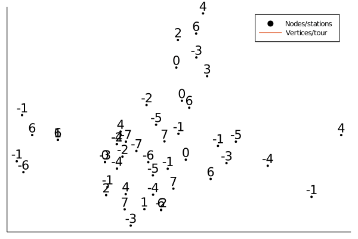

# BikeSharingRebalancing.jl

BikeSharingRebalancing.jl is a Julia package for dealing with static bike sharing rebalancing problems (SBSRP). These are problems that are modification of popular traveling salesman problem. But additionally each node/point has given deficit or surplus of bikes. The solution is a tour that is the shortest and beside classical TSP constraint also relocate bikes, so there is no deficit of them. 

* Package includes 3 algorithms to deal with SBSRP:
    * modification of greedy algorithm `greedy_algo_SBRP()`.
    * algorithm that relaxes SBSRP problem, solves it in a quasi-analytical way and then permutes infeasible stations `permute_relax_SBSRP()`.
    * and one that relaxes SBSRP and solves remaining stations with greedy algorithm `relax_greedy_SBSRP()`.
* Additionally there are numerous functions that support analyzing these problems and real dataset of bike sharing system.

## Current status

Package is not yet registered in general registry, so one cannot load it with `] add BikeSharingRebalancing.jl`. It is possible to find more advanced algorithms in some papers on that matter, thus fell free to contribute to this repository.

## Example 
Here is a solution of one of the algorithms. Nodes are stations and numbers above are deficits or surpluses of bikes. The data on this bike sharing system and routes between stations is taken from Open street map, thus the solution is applicable to real life.

## Additional information

This package is a product of research done by Mateusz Dadej and Julia Karpińska from University of Gdańsk on VI polish conference of student's associations in Szczecin, and was awarded first place.

Feel free to contact me in any case. mateuszdadej@gmail.com

